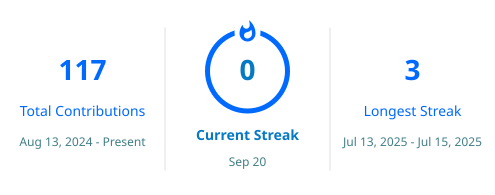

# Hi 👋, I'm Ayush Kumar Senapati

### ☁️ Cloud & Full-Stack Developer | AWS | React.js | Node.js | DevOps

  

 

  
  
  

---

## 👋 About Me

🎓 **B.Tech in Computer Science & Engineering (2023 – 2027)**

🏫 **Centurion University of Technology and Management, Bhubaneswar**

☁️ I'm an aspiring **Cloud Engineer and Full-Stack Developer** focused on building scalable applications and deploying modern solutions using cloud technologies.

💻 I have hands-on experience with **AWS, React.js, Node.js, Express.js, MongoDB, JavaScript, Python, Git and GitHub**.

⚙️ I'm interested in **Cloud Computing, DevOps, CI/CD, Linux, Docker and Full-Stack Web Development**.

🚀 I enjoy turning ideas into practical projects and continuously improving my skills through hands-on development and cloud projects.

🎯 My long-term goal is to build a career in **Cloud Engineering and DevOps**, while strengthening my software development and infrastructure skills.

---

## 🚀 Current Focus

- ☁️ Building and deploying applications using **AWS Cloud Services**
- 💻 Developing modern **Full-Stack Web Applications**
- 🐳 Learning **Docker, Linux and DevOps practices**
- ⚙️ Exploring **CI/CD pipelines and cloud automation**
- 📚 Strengthening my knowledge of **Cloud Architecture and Infrastructure**
- 🎯 Preparing for **Cloud Engineering and DevOps opportunities**

---

## 🌐 Connect With Me

---

## 💼 Experience

### ☁️ Web Development Intern — CodSoft

**Web Development Internship**

* 🚀 Built and developed multiple **Full-Stack and React-based web applications**.
* 💼 Developed a **Job Board Application** with React.js, Node.js, Express.js and MongoDB.
* 🧠 Built an **Online Quiz Maker** using React.js, Firebase Authentication and Firestore.
* 🔐 Worked with authentication, databases, REST APIs and responsive user interfaces.
* 🛠️ Used **Git & GitHub** for version control and project management.

---

### 💻 Java Full-Stack Development Intern

**Centurion University of Technology and Management, Bhubaneswar**

📅 **2026**

* 🌐 Gained practical experience in **Java Full-Stack Web Development**.
* ⚙️ Worked with frontend, backend and database concepts while developing web applications.
* 🧩 Strengthened understanding of application architecture, development workflows and debugging.
* 🤝 Collaborated in a practical development environment and improved problem-solving skills.

---

### 🌐 Web Development Intern — Skill Bird Technologies

📅 **June 2025 – July 2025**

* 💻 Developed responsive web pages using **HTML, CSS and JavaScript**.
* 📱 Worked on responsive layouts and reusable frontend components.
* 🔧 Used **Git and GitHub** for source-code management and project updates.
* 🚀 Improved practical frontend development and web-design skills.

---

## 🚀 Featured Projects

### 💼 Job Board Application

**React.js • Node.js • Express.js • MongoDB**

* 🔎 Search and filter jobs by **title, company, location and job type**
* 👤 Supports job browsing, detailed job information and user-friendly navigation
* ❤️ Includes job favorites and organized job categories
* ⚙️ Built with a modern **Full-Stack architecture**
* 🗄️ MongoDB used for scalable data management

---

### 🧠 Online Quiz Maker

**React.js • Firebase Authentication • Firestore**

* 📝 Create, manage and attempt interactive quizzes
* 🔐 Secure user authentication using **Firebase Authentication**
* 📊 Calculates score, correct, incorrect and unanswered questions
* 🗄️ Stores quizzes and user results using **Cloud Firestore**
* 👤 Includes personalized user dashboard and quiz history

---

### ☁️ Portfolio Website with AWS CI/CD

**AWS S3 • GitHub Actions • IAM • CI/CD**

* 🌐 Hosted a static portfolio website using **Amazon S3**
* ⚙️ Implemented automated deployment using **GitHub Actions**
* 🔐 Configured **AWS IAM permissions** for secure deployments
* 🚀 Automated website updates whenever changes are pushed to GitHub
* ☁️ Gained hands-on experience with cloud hosting and CI/CD workflows

---

### 🏠 Real Estate Management System

**React.js • JavaScript • LocalStorage • React Router**

* 🏘️ Built a property management platform with add, edit and delete functionality
* 🔍 Provides detailed property information and agent contact features
* 🧭 Implemented multiple application pages using **React Router**
* 💾 Managed property information using browser **LocalStorage**
* 📱 Designed a responsive and user-friendly interface

---

## 💻 Tech Stack

### Languages

  

### Frontend

  

### Backend

  

### Databases & Backend Services

  

### Cloud

  

### DevOps & Tools

  

---

## 📚 Currently Learning

* ☁️ **Advanced AWS Cloud Architecture** and scalable cloud solutions
* 🐳 **Docker & Containerization** for modern application deployment
* ☸️ **Kubernetes** fundamentals and container orchestration
* 🐧 **Linux Administration & Networking** for cloud environments
* ⚙️ **DevOps, CI/CD & Automation** using modern development workflows
* 🏗️ Strengthening knowledge of **Cloud Infrastructure & System Design**

---

## 🏆 Certifications & Achievements

* ☁️ **AWS Solutions Architect**
* 🔴 **Oracle Cloud Infrastructure – Foundations Associate**
* 🔴 **Oracle Cloud Infrastructure – DevOps Professional**
* 💻 Completed **Java Full-Stack Development Internship**
* 🌐 Completed **Web Development Internship – Skill Bird Technologies**
* 🚀 Completed **Web Development Internship – CodSoft**
* 🧠 Participated in **Generative AI & Technology Workshops**

---

## 📈 GitHub Statistics

 

 

---

## 🧠 Core Skills

- ✅ AWS Cloud Services
- ✅ Cloud Computing & Infrastructure
- ✅ React.js
- ✅ Node.js & Express.js
- ✅ REST API Development
- ✅ MongoDB & MySQL
- ✅ Firebase & Firestore
- ✅ Git & GitHub
- ✅ Docker & Containerization
- ✅ Linux Administration
- ✅ CI/CD & GitHub Actions
- ✅ Cloud Deployment
- ✅ Problem Solving

---

## 🎯 Career Objective

To build a career as a **Cloud Engineer and DevOps professional**, designing scalable, secure and reliable cloud solutions while continuously strengthening my knowledge of **AWS, automation, CI/CD, containerization and modern software development**.

I aim to combine my **Full-Stack Development** experience with cloud technologies to build, deploy and manage production-ready applications and infrastructure.

---

## 🤝 Let's Collaborate

I'm interested in collaborating on:

- ☁️ **AWS & Cloud Computing Projects**
- ⚙️ **DevOps and CI/CD Projects**
- 🐳 **Docker & Containerized Applications**
- 💻 **Full-Stack Web Applications**
- 🚀 **Cloud-Based Application Development**
- 🌐 **Open Source Projects**
- 🤖 **AI-powered Web Applications**

---
